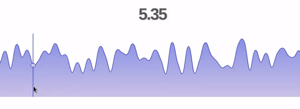

# React Line Graph
> A lightweight and simple line graph component.

[![NPM Version][npm-image]][npm-url]
[![Build Status][travis-image]][travis-url]
[![Downloads Stats][npm-downloads]][npm-url]

Supports Bezier smoothing, easy customization, and hover interactivity.



## Table of Contents

1. [Requirements](#requirements)
2. [Installation](#installation)
3. [Usage](#Usage)
4. [Development Setup](#Development-setup)
5. [Testing](#Testing)
6. [Release History](#release-history)
7. [Meta](#meta)
8. [Contributing](#contributing)
9. [To-do](#todo)
10. [Challenges](#challenges)

## Requirements

An `nvmrc` file is included if using [nvm](https://github.com/creationix/nvm).

- Node 8.10.0

## Installation
OS X & Linux:
```sh
npm install react-line-graph
```
## Usage

Usage is quite simple. First, import the component (React 16.8.0 or higher is required as an installed dependency or CDN):
```sh
import LineGraph from 'react-line-graph'
```

Render the line:

```sh
const data = [10,0,-2.5,540]; // LineGraph reads these as y-values, automatically spaces them out evenly
<LineGraph data={data}/>
```
or 
```sh
const data = [[0,20], [-30,40], [-88.9, 9]]; // LineGraph reads these as x,y pairs
<LineGraph data={data}/>
```
or 
```sh
const data = [ { x: 10, y: 2 }, {...}];
<LineGraph data={data}/>
```

Customizing your graph is easy:
```sh
const data = [10,0,-2.5,540];
const props = {
  data,
  smoothing: 0.3,
  accent: 'palevioletred'
  fillBelow: 'rgba(200,67,23,0.1)',
  hover: true,
};

<LineGraph {...props}/>
```
_This renders a smooth graph with hovering enabled. The y-value is passed down to child components upon hover by default, but this can be changed._

### Props ###
| Key       | Type             | Default          | Description                                                                                                                        |
|-----------|------------------|------------------|------------------------------------------------------------------------------------------------------------------------------------|
| data      | Array (required) | []               | The data points to render. May be of form [a,...,b], [[a,b],...,[c,d]], or [{x: a, y: b},...,{...}] where a,b,c,d are some numbers |
| smooth    | Number (0 to 1)  | 0                | The Bezier smoothing ratio to apply.                                                                                               |
| accent      | String           | 'black' | The color of the line accents                                                                                         |
| fillBelow | String           | 'none'           | The color of the fill below the line.                                                                                              |
| fillAbove | String           | 'none'           | The color of the fill above the line.                                                                                              |
| hover     | Boolean          | false            | Enables hovering. Hovering will render a line and will pass on the hovered value to children (this component is child-aware).      |
| gridX     | Boolean          | false            | Shows the grid-lines along the x-axis (vertical lines).                                                                            |
| gridY     | Boolean          | false            | Shows the grid-lines along the y-axis (horizontal lines).                                                                          |
| debug     | Boolean          | false            | Displays debug information on graph, including anchor and control points.                                                          |
| width     | String           | '100%'           | The width of the component within a container element.                                                                             |
| height    | String           | '100%'           | The height of the component within a container element.                                                                            |
| compression| Number           | 0.1           | The compression factor of the data-set from 0 to 1. Compresses data linearly from top and bottom along the Y-axis.                            |
| onHover| Function           | () => {}           | The callback function to which an array containing currently hovered point ([x, y]) is passed when the user hovers. Useful for displaying the hovered value in the parent component (the one you write). Only active when 'hover' is set to true.          |

_For more examples and usage, please refer to the [Wiki][wiki] (under development)._

## Development setup
For developers (OS X / Linux):

From within the root directory: 
```sh
npm install
npm start
```
## Testing
From within the root directory: 
```sh
npm test
```

## Release History
* 1.0.3
    * First patched release
    * CHANGE: bug-fixes, new features. See release for details.
* 1.0.0
    * The first proper release
    * CHANGE: Add Bezier smoothing transformation function
* 0.1.0
    * Work in progress

## Meta

Umair Nadeem – [@UmairNadeem](https://github.com/umairnadeem) – umair@umairnadeem.com

Distributed under the MIT license. See ``LICENSE`` for more information.

[https://github.com/umairnadeem/react-line-graph](https://github.com/umairnadeem/)

## Contributing

1. Fork it (<https://github.com/umairnadeem/react-line-graph/fork>)
2. Create your feature branch (`git checkout -b feature/fooBar`)
3. Commit your changes (`git commit -am 'Add some fooBar'`)
4. Push to the branch (`git push origin feature/fooBar`)
5. Create a new Pull Request

<!-- Markdown link & img dfn's -->
[npm-image]: https://img.shields.io/npm/v/datadog-metrics.svg?style=flat-square
[npm-url]: https://npmjs.org/package/datadog-metrics
[npm-downloads]: https://img.shields.io/npm/dm/datadog-metrics.svg?style=flat-square
[travis-image]: https://img.shields.io/travis/dbader/node-datadog-metrics/master.svg?style=flat-square
[travis-url]: https://travis-ci.org/dbader/node-datadog-metrics
[wiki]: https://github.com/umairnadeem/react-line-graph/wiki

## Feature Requests
- Put all helper methods in a class
- Fix smoothing algorithm to be more precise using cubic Beziers
- Clean up prop passing in InteractionLayer*
- Refactor hover to not use setState (better performance)
- Update compression algorithm to be two-way (compress highs and lows)*
- Allow 3 different data input types (create helper function 'parse')
- Remove unnecessary re-render of graph upon setState in parent component
- Refactor LineGraph's index.jsx with React Hooks*
- Publish on NPM, update README tags*
- Allow multiple transformation functions in drawPath function, using piping
- Prevent re-run of findCtrlPoint function upon hover
- Allow exponential smoothing for large data-sets

## Challenges
- Make hovering compatible with responsive height/width: need 3 data points per axis (viewBox dimension, cursor position, current dimension)
- Pass up hovered point information into parent
- Allow parent to setState with point information without triggering unecessary re-render
- Writing a smoothing algorithm using cubic Bezier without artifacts
- Modular transformation callback in drawPath helper